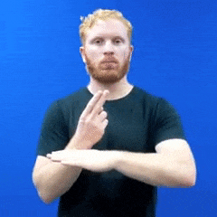
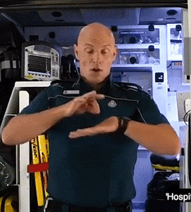
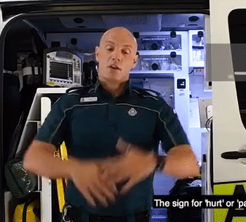
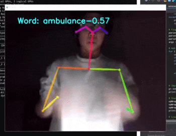
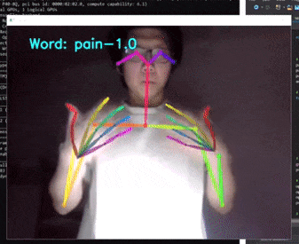
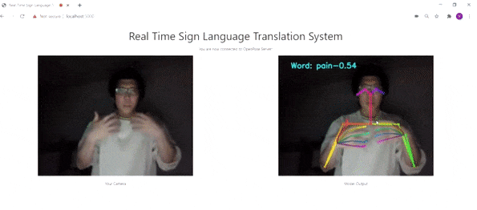

# capstone 2020: real-time pose estimation
* semester 2; 3 august, 2020;

## group members;
* Tsz Kiu
* Matthew
* Yong Yick

## updates;
1. the team has developed a basic real-time Australian Sign Language (AusLan) recognition system on top of a real-time pose estimation system;
2. We restrict to recognizing emergency signs as:
   * this restricts the scope;
   * we don't have the capacity to develop a true translation system instead of a recognition;
   * as such, we develop it with the idea of deploying it for indoor monitoring and surveilling purposes to bring its values;
3. so far, the system is capable of detecting four dynamic signs: {"ambulance", "help", "hospital", "pain"}. see below for further infomation;
3. we view the recognition as a time-series classification, thereby deploying a form of Recurrent Neural Network (RNN), called Long-short-term-memory (LSTM) to be the recognizing mechanism;

## preambles;
here are the above-mentioned signs taken from [Official Auslan SignBank](http://www.auslan.org.au/dictionary/) and other internet resources for your reference;

<table>
  <tr>
    <td>ambulance</td>
     <td>help</td>
   </tr>
  <tr>
   <td valign="top"> </td>
    <td valign="top"></td>
  </tr>
    <td>
         <tr>
            <td>hospital</td>
             <td>pain</td>
           </tr>
          <tr>
           <td valign="top"> </td>
            <td valign="top"></td>
          </tr>
    </td>
</table>

## our work so far;
1. in figure 1, it took approximately 3 second to recognize a complete sign up to confidence level of 80%;
2. in figure 2, similar to figure 1; this is to show the system is able to recognize different signs in a row;
3. in figure 3, we tried deploying online on web browser, it's considerably slower; real-time could not be realized yet; 

<table>
  <tr>
    <td>Figure 1</td>
     <td>Figure 2</td>
   </tr>
  <tr>
   <td valign="top"> </td>
    <td valign="top"></td>
  </tr>
 </tr>
  </table>

<table>
<tr>
    <td>Figure 3</td>
   </tr>
  <tr>
     <td valign="top"> </td>
  </tr>
 </tr>
                   </tr>
    </td>
</table>

## todo;
1. to expand the signs database;
2. to consider including static signs;
3. to improve the latency of the recognition;
4. to improve the recognition model and explore other models;
5. to fill up our missing knowledge and theoretical gap, especially in terms of tuning the necessary hyperparameters of the model(s);
6. to consider developing GUI, or deploying on web, and other devices if time permits; 

