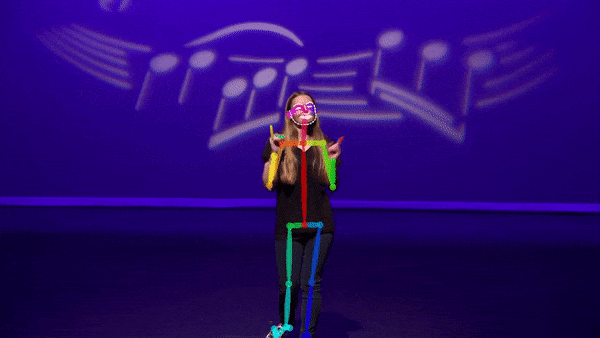

# week 04 - progress summary

## Content

    A. OpenPose's Limitations, at least from qualitative perspective;
    B. Rough Comparison of the Frameworks;
    C. Challenges Discovered so Far;

### A. Outputs from Openpose via Colab *(Google Cloud Computing Platform)*

* Colab Link (<https://drive.google.com/open?id=1GcY4XnW9mMYYhXSb6ufyra-9HnYIfYWm>)

1. Figure 01 (src = <https://www.youtube.com/watch?v=p0ufyoe0URA>)

2. Figure 02 (src =  <https://www.youtube.com/watch?v=21e4blKXPpE>)

3. Figure 03 (src =  <https://www.youtube.com/watch?v=ccegYtfGB4o>)

4. Figure 04 (src =  <https://www.youtube.com/watch?v=0UakYLTiplc&t=2s>)

### B. Comparison of the Frameworks

1. The state-of-art pose estimations:
    * OpenPose
        * <https://github.com/CMU-Perceptual-Computing-Lab/openpose>
    * AlphaPose
        * <https://github.com/MVIG-SJTU/AlphaPose>
    * Detectron
        * <https://github.com/facebookresearch/Detectron/blob/master/README.md>
        * <https://github.com/eddieyi/caffe2-pose-estimation>
2. RNN and AlphaPose do not support hand and face gesture. Their performances are relatively better than OpenPose in terms of speed, accuracy and robustness.
3. OpenPose has a relatively large community.

### C. (OpenPose) Challenges Discovered so Far

1. With only CPU, the speed is around 0.1 frame per second (fps) which is significantly lower to what GPU could achieve: at least 10 fps ==>  ***No real time pose estimation with CPU given the original architecture of OpenPose.*** (<https://github.com/CMU-Perceptual-Computing-Lab/openpose/issues/566>)
2. CUDA *(application driver for NVDIA GPU)* as the main implementation.  *(This is generally true for other platforms as CUDA is far superior.)* OpenPose also supports OpenCL *(AMD GPU)*, but it would require manual configuration. Either way, there are certain requirements on both GPU specs. (Check "Requirements and Dependencies"; <https://raw.githubusercontent.com/CMU-Perceptual-Computing-Lab/openpose/master/doc/installation.md>)
3. See Figure 01. The pose estimation for a simple hand gesture fails if only hand is present. For other frameworks *(Detectron, AlphaPose)*, as mentioned, they do not support hand pose so far.

4. See Figure 02. The pose estimation is not robust to the lighting (environment). This is generally true with other frameworks.

5. See Figure 03. We could see the pose estimation works fairly well for the fast and complex sign movement which may not be the case for music gesture. However, there is a problem:
    * ***this points out that the relative position (distance and orientation) of the body (hand) to the camera will be an issue for gesture recognition.***
    * We have to squeeze our eyes just to see the keypoints of the hands.
6. See Figure 04. The clothing fools OpenPose.
7. See Figure 01 - 03, there are certain instances of simple hand gestures that cannot be estimated. Even so, would a 3D Pose estimation be more suitable for gesture control for musical mapping?
8. See all figures. Occlusion problem is obvious. (<https://stackoverflow.com/questions/2764238/image-processing-what-are-occlusions)>
9. Remember, here we are using Colab to compile from source. There will be a lot of work in pose estimation stage, let alone with real-time system and gesture mapping. Also, by above, Computer Vision which involves deep/machine learning generally runs on CUDA, hence not hardware-agnostics. This is not a trivial problem at all, if we were to implement it as an executable file (complete software) that can run on any pc.
10. ***No training sets*** for gesture recognition in the context of musical-parameter mapping?! *(Further investigation is needed.)*
